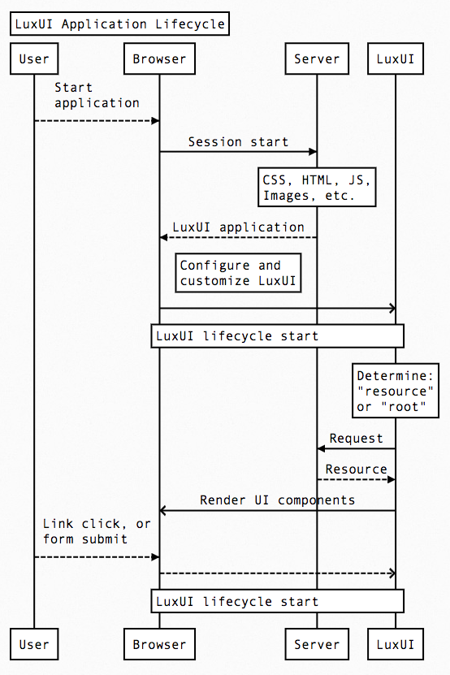

Contributing Guide
==================

GitHub has some good content on the practice of [contributing to open source
projects][GitHub Guide].

## Setup

The basics of getting your own working development version of LuxUI.

  1. [Fork](https://help.github.com/articles/fork-a-repo/) the LuxUI repository
      on GitHub
  2. Clone your fork of LuxUI; named "origin" to follow convention.

      `git clone -o origin <your_repository_url>`

  3. Add the "upstream" repository so you can pull in the newest changes in the
      future; named "upstream" to follow convention.

      `get remote add upstream <repo_url_here>`

  4. Install package dependencies.

      `npm install`

  5. Install all peer dependencies
      a. [AirBnB ESLint dependencies](https://www.npmjs.com/package/eslint-config-airbnb)
      b. Peer dependencies (`peers.js`) *check the `package.json`
        "peerDependencies" listing to be sure that only package versions are
        identified and not anything that could be harmful scripts, as the
        following command executes the following command `npm install
        ${package_name}@{package_version}`.*

  6. *After a successful install, it is recomended to, restore the previous
    version of the package lock file (`package-lock.json`) by executing:
    `git checkout -- package-lock.json`.*

  7. Run all tests to make sure everything is installed correctly and that your
      new changes will be starting with all tests passing.

      `npm test`

  8. (OPTIONAL) Run linter to be sure that all code is "Lint-free".

      `npm run lint`

  9. Always develop changes on a development branch so they can be easily
      updated from "upstream"; [Atlassian Tutorial on `rebase`](https://www.atlassian.com/git/tutorials/rewriting-history/git-rebase).

      `git checkout -b <your_development_branchname>`

The LuxUI project(s) use [ESLint][ESLint] and [Babel][Babel], each of these has
optional integrations for various IDEs and editors.

## What can you contribute?

Some excellent ways to help the project are:

  1. Bugs - find and then report them in the repository issue tracker.
  2. Documentation - update it to be more clear and informative or point out
      mistakes.
  3. Guides - write one or try one to keep them accurate and relevant.
  4. Pull Requests - write features to close issues.
  5. Tests - improve robustness of existing tests or write tests for cases that
      have been missed.
  6. Questions - if you can't find the answer to some question point that out
      so that it can be covered somewhere.
  7. Communicate - please feel free to communicate any joy or sadness that this
      project has brought you; the former will make us feel good and the later
      will encourage us to be better in the future.
  8. Other - for anything else that pertains to the project opening an issue
      for change is a good thing to do.

## Code of Conduct

It's really too bad that we even need to say these things explicitly but this
project adheres to a [Code of Conduct][Conduct] borrowed from the
[Contributor Covenant][Covenant]. By participating, you are expected to uphold
this code. Please report unacceptable behavior to at least one of the people
listed in the `maintainers` list in the project's [package.json].

## Contributors Pledge

If you choose to add your name to the list of `contributors`, you are pledging
to:

  - Follow the [Code of Conduct][Conduct],
  - Adhere to the suggestions in this [Contributing Guide][Contribute],
  - Freely release all contributions of code or other content to this project.

## Maintainers Pledge

If you choose to add your name to the list of `maintainers`, you are pledging
to:

  - Help *uphold* the [Code of Conduct][Conduct],
  - Respond to new issues in a [timely manner](#timely-response).

These responsibilities are in **addition** to the [Contributors Pledge](#contributors-pledge).

### Timely Response

We will try to respond to all new issues and newly opened Pull Requests within
24 hours; even if that response is to say that it will be a few days before any
meaningful feedback can be given. It is important to be transparent with what
is happening with a proposed change. Not all proposed changes will be accepted
as not all changes will align with the goal of the project.

If you propose changes and don't hear back after a day or two feel free to
comment again to hopefully ping us again to remind us to respond; we hope that
this does not become a normal event.

## Changes

When you decide that you would like to contribute code, or other content, to
the project you will need to:

  1. Provide your changes in a Pull Request from a branch in your own fork of
      the repository; never commit directly to the `master` branch as that
      should be reserved as a landing place for upstream changes.
  2. Code changes should be fully unit/integration tested and documented in the
      Pull Request; without tests covering the changes the Pull Request will
      not be accepted.
  3. Pull Requests should be submitted as, at most, one commit with an
      appropriate commit message, following our [commit message guidelines](#commit-messages).
  4. Each Pull Request should be confined to as few issues as possible -
      ideally one each - to keep the size and scope of changes to a minimum

If you need help with any of these feel free to reach out to one of the people
in contributors list in [package.json].

### Commit Messages

All Pull Request commit messages, and many others, should follow this format
for commit messages:

```
# 52 characters --------------------------------->|
Summary; capitalized; imperative mood; no period
#                                                        [a blank line]
# 72 characters ----------------------------------------------------->|
Detailed description of changes if not summarized completely by the
first line title summary; lines in this detailed description should
wrap around 72 characters.
#                                                        [a blank line]
# Additional paragraphs separated by blank lines. All content should
# use the imperative mood and focus on answering for WHAT and was
# changed and, possibly, also WHY; avoid explaining HOW.
#                                                        [a blank line]
# [fixes|closes] #0000
```

Included in this repository is a `./commit.template` file that you can set as a
commit message template using the command:

```bash
$ git commit commit.template ./commit.template
```

Read more about the [Git Commit Templating][Git Templating] feature.

### Code Style

The coding style is very similar to the [airbnb] style, with a few changes:

  - Restrict the complexity of functions because too much complexity is
      difficult to manage. `complexity`
  - Prefer double-quotes in JSX. `jsx-quotes`
  - Restrict the nesting depth of functions; because complexity. `max-depth`
  - Restrict the number of function parameters; because complexity. `max-params`
  - Restrict the number of statements on a line; because who needs multiple
      statements on a single line. `max-statements-per-line`
  - Line length is adhered to as often as possible with exceptions for: `max-len`
    + Error strings
    + JSX or markup
    + URLs
  - Lines that `return` values should have an empty line before them. `newline-before-return`
  - Function arguments can be reassigned; though it is not encouraged. `no-param-reassign`
  - Within function bodies using a function before it is defined due to
      alphabetization is allowed. `no-use-before-define`
  - Conflicting preferences `padded-blocks` and `newline-before-return`; the
      required newline before returns "wins". `padded-blocks`
  - No `.jsx` filenames for ReactJS files; just `/js`. `react/jsx-filename-extension`
  - Conflicting non-ESLint preference for alphabetization rather than arbitrary
      or subjective ordering of functions/methods (mentioned below). `react/sort-comp`
  - Any help with documentation is going to be helpful in the long-run - and
      was immediately upon turning this option on. `valid-jsdoc`

[ESLint] is the preferred way of enforcing the style guide and has plenty of
integrations with IDEs and editors to help automate that for you. Additionally
you can run the linter using `npm run lint` at your command line prompt.

Additionally prefer alphabetization over other arbitrary, or subjective,
ordering of function/method definitions. For variables sometimes naming
collides with alphabetization so logic is preferred over contorting variable
names to fit.

### Code Conventions

This project's code follows a more functional programming (FP) paradigm, over
an Object-oriented (OOP) paradigm. When possible write "pure" functions/modules
which do not have state or side effects.

## Project Structure

The `lib/` directory holds all code that is cross-cutting and implementation
library agnostic while the other directories in `src/` will hold implementation
- library/framework/whatever - specific code; for instance, the reference
implementation uses [ReactJS] and all code for that implementation is in
`src/react/`.

Some future implementation possibilities are:

  - [Riot](http://riotjs.com/)
  - [Vue](https://vuejs.org/)
  - [Ember](http://emberjs.com/)
  - [Angular](https://angular.io/)
  - [Polymer](https://www.polymer-project.org/1.0/)
  - YUI - just kidding!

## Architecture Diagrams



[airbnb]: https://github.com/airbnb/javascript
[Babel]: https://babeljs.io/
[Conduct]: CODE_OF_CONDUCT.md
[Contribute]: CONTRIBUTING.md
[Covenant]: http://contributor-covenant.org
[ESLint]: http://eslint.org/
[Git Templating]: https://git-scm.com/docs/git-commit#git-commit---templateltfilegt
[GitHub Guide]: https://guides.github.com/activities/contributing-to-open-source/
[ReactJS]: https://facebook.github.io/react/
